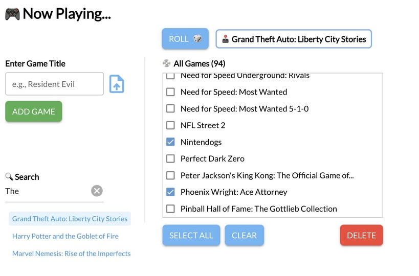

# 🎮 Now Playing... Game Randomizer

  

A stylish and intuitive **game randomizer** and collection manager built by **Chris Cardi** using [NiceGUI](https://nicegui.io). Add games manually or via CSV, search through your entire list, and roll a random pick when you can’t decide what to play.

---

## 📸 Screenshots



---

## 📖 Overview

This lightweight web app provides:

* 🖥️ Clean, responsive interface built with NiceGUI
* 📥 CSV import support with duplicate checking and input sanitization
* 🗃️ Local SQLite database with persistent storage
* 🎲 One-click random game picker
* ✅ Bulk select and delete games with confirmation
* 🔍 Search with auto-scroll

Ideal for game hoarders, backlog tamers, and indecisive gamers everywhere.

---

## 📁 Contents

| File               | Description                                         |
| ------------------ | --------------------------------------------------- |
| `assets/`                      | UI screenshot                              |
| `NowPlaying.py`        | Main NiceGUI application containing all core logic  |
| `quick_games.db` | SQLite database file that stores your list of games |
| `README.md`      | This file                                           |

---

## 🛠️ Requirements

* Python 3.9+
* [NiceGUI](https://pypi.org/project/nicegui/)
* SQLite3

Install dependencies:

```bash
pip install nicegui
```
